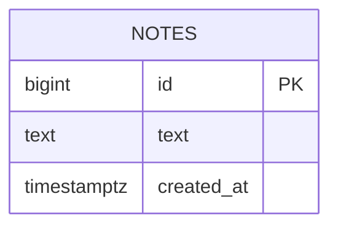

# Database Design (ERD) — Sticky Notes

Engine: PostgreSQL 16
Last updated: 2026-05-27
Source requirements: `docs/notes/SRS.md`

## 1. Overview

Schema stores saved sticky notes. `notes` is sole aggregate root and only table. Card motion, live count, and empty state are derived by application from note rows; no accounts, metadata, or soft-delete history are stored.

## 2. Diagram

No relationships exist. Therefore no cardinality or optionality edges exist.

## 3. Entities

### 3.1 `notes`

**Purpose** — stores each saved note for listing, creation, and deletion. **Traces to** — NOTES-001, NOTES-002, NOTES-003.

| Column | Type | Null | Default | Unique | Description |
|---|---|---|---|---|---|
| `id` | `bigint` | no | generated always as identity | PK | Internal generated note identifier; satisfies SRS integer ID. |
| `text` | `text` | no | none | no | Note body, limited to 280 characters. |
| `created_at` | `timestamptz` | no | `now()` | no | UTC creation time shown on cards and used for newest-first ordering. |

`updated_at` is deliberately omitted: requirements store only ID, text, and creation timestamp, and notes cannot be edited.

**Nullable columns** — none.

**Foreign keys** — none; no relationships exist, so no `ON DELETE` or `ON UPDATE` action applies.

**Constraints**

- Primary key on `id` enforces unique stable note identity.
- `ck_notes_text_nonempty` — `CHECK (length(btrim(text)) > 0)` rejects empty or whitespace-only note bodies.
- `ck_notes_text_max_length` — `CHECK (length(text) <= 280)` enforces NOTES-002 maximum at storage boundary.

**Indexes**

| Name | Columns | Type | Query it serves |
|---|---|---|---|
| `idx_notes_created_at_id_desc` | `created_at DESC, id DESC` | btree | List every note newest first: `ORDER BY created_at DESC, id DESC`; `id` makes equal timestamps deterministic. |

**Lifecycle** — hard delete. NOTES-003 requires removal; no audit, reporting, or retention requirement justifies soft delete. Deletion removes row permanently.

## 4. Enumerations

None. No field has fixed set of values.

## 5. Access patterns

| # | Pattern | Frequency | Index used |
|---|---|---|---|
| 1 | List all saved notes newest first | Every page load and after mutation | `idx_notes_created_at_id_desc` |
| 2 | Insert note | Each Add action | Primary-key identity; no read index required |
| 3 | Delete one note by ID | Each Delete action | Primary key on `id` |
| 4 | Count saved notes | Page load and after mutation | Sequential count is acceptable for stated 100-note target; no count index exists in PostgreSQL. |

## 6. Data volume and growth

| Table | Rows at launch | Growth | Retention |
|---|---|---|---|
| `notes` | 0 | Low; no volume target beyond 100-note performance requirement | Until guest deletes row; hard delete removes it permanently |

No table is expected to reach 10M rows within a year. No partitioning or archival needed in approved scope.

## 7. Integrity, privacy, and security

- Database enforces identity, non-null fields, non-empty trimmed text, and 280-character maximum. HTTP boundary also validates input for clear client errors.
- Newest-first ordering is application query contract using `created_at DESC, id DESC`; `id` breaks timestamp ties.
- `created_at` default is database time, not client input.
- No personal data, secrets, accounts, or row-level access rules exist. Guest may access all note rows by approved scope.

## 8. Migrations

| # | Change | Forward | Backward | Safe on non-empty table |
|---|---|---|---|---|
| 1 | Initial notes schema | `000001_create_notes.up.sql`: create `notes`, constraints, and `idx_notes_created_at_id_desc`. | `000001_create_notes.down.sql`: drop `notes` (index drops with table). | Yes for schema creation on an existing database with no `notes` table. Down migration is destructive if rows exist; use only before data must be retained. |

No backfill or concurrent index strategy is needed for initial empty table. Future applied migrations must remain immutable and use new paired files.

## 9. Open questions

none.
