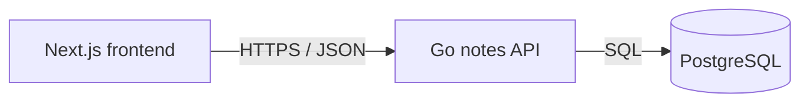

# Service & Interface Design — Sticky Notes

Last updated: 2026-05-27
Source: `docs/notes/SRS.md`, `docs/architecture/erd.md`, `docs/architecture/overview.md`

## 1. Service map



| Service | Responsibility | Owns (tables) | Depends on | Deploy unit |
|---|---|---|---|---|
| Notes API | List, create, and hard-delete notes | `notes` | PostgreSQL 16 | `backend` container |

**Why these boundaries** — single service: no ownership, scaling, or deploy-cadence boundary justified yet. Notes API is sole writer and reader of `notes`.

## 2. Cross-cutting contract

### 2.1 Base

- Backend route base: `/v1`. Deploy proxy strips external `/api` prefix before backend routing; no backend route begins `/api`.
- Content type: `application/json; charset=utf-8` for request and JSON response bodies.
- Versioning: URL path major version. New major version only for breaking changes.
- Trace header: `X-Request-Id` accepted from caller, generated when absent, echoed on every response, and logged with every request.
- IDs: decimal `bigint` values encoded as JSON strings. Timestamps are RFC 3339 UTC strings.

### 2.2 Authentication and authorization

| Aspect | Decision |
|---|---|
| Mechanism | None; all callers are guests in approved scope. |
| Token lifetime | Not applicable. |
| Refresh | Not applicable. |
| Transport | No `Authorization` header required. |
| Roles | None. |
| Enforcement point | Not applicable; no protected resources exist. |

### 2.3 Error contract

Every non-2xx response has this shape:

```json
{
  "error": {
    "code": "VALIDATION_FAILED",
    "message": "Text must be 1 to 280 characters.",
    "details": [
      { "field": "text", "code": "OUT_OF_RANGE", "message": "Text must be 1 to 280 characters." }
    ],
    "request_id": "01HX..."
  }
}
```

`details` is an empty array when no field-level detail applies. Consumers branch on `code`; `message` and detail messages are safe display text, not stable parsing keys.

| Code | HTTP | Meaning | Retryable |
|---|---:|---|---|
| `MALFORMED_REQUEST` | 400 | Invalid JSON, unsupported JSON type, or body exceeds 4 KiB. | no |
| `VALIDATION_FAILED` | 422 | Well-formed external value violates documented constraints. | no |
| `UNAVAILABLE` | 503 | PostgreSQL unavailable, migration in progress, or service draining. | yes |
| `INTERNAL` | 500 | Unexpected failure; internal detail logged only. | yes |

### 2.4 Pagination

No pagination parameters exist. `GET /v1/notes` deliberately returns every note because SRS explicitly excludes pagination and performance target is 100 stored notes. Response uses collection envelope so future cursor pagination can be additive. Stable default order is `created_at DESC, id DESC`.

### 2.5 Validation boundary

Go HTTP handler is validation boundary, before any SQL call. It caps request body at 4 KiB, parses JSON strictly, rejects unknown fields, validates `text` as a JSON string of 1–280 Unicode characters after trimming whitespace for emptiness, and validates `{id}` as positive decimal `bigint`. Downstream service and repository code trust validated values. Database constraints remain integrity backstop.

### 2.6 Idempotency

`POST /v1/notes` accepts no `Idempotency-Key`; scope has one guest client and no retrying intermediary contract. Client must not automatically retry an uncertain create. `DELETE /v1/notes/{id}` is intrinsically idempotent: an existing or already-absent valid ID returns `204`; no key retained.

## 3. Endpoints

### 3.1 `GET /v1/notes`

**Purpose** — list all saved notes newest first and provide live total. **Traces to** — NOTES-001. **Auth** — none.

**Path / query parameters** — none. Query parameters are rejected with `VALIDATION_FAILED` to keep fixed list semantics.

**Request body** — none.

**Success response** — `200`

```json
{
  "data": [
    {
      "id": "42",
      "text": "Buy tea",
      "created_at": "2026-05-27T10:04:18Z"
    }
  ],
  "total": 1
}
```

| Field | Type | Nullable | Description |
|---|---|---|---|
| `data` | array of note | no | Every saved note, ordered `created_at DESC, id DESC`. |
| `data[].id` | string | no | Decimal note ID. |
| `data[].text` | string | no | Stored note body. |
| `data[].created_at` | string | no | Creation timestamp in RFC 3339 UTC. |
| `total` | integer | no | Exact count of objects in `data`. |

**Errors**

| Code | HTTP | Trigger |
|---|---:|---|
| `VALIDATION_FAILED` | 422 | Any query parameter supplied. |
| `UNAVAILABLE` | 503 | Database cannot serve read. |
| `INTERNAL` | 500 | Unexpected read failure. |

**Notes** — no side effects. List and total must come from same read snapshot so `total` matches `data`.

### 3.2 `POST /v1/notes`

**Purpose** — save one note. **Traces to** — NOTES-002. **Auth** — none.

**Path / query parameters** — none. Query parameters are rejected with `VALIDATION_FAILED`.

**Request body**

```json
{ "text": "Buy tea" }
```

| Field | Type | Required | Constraints | Description |
|---|---|---|---|---|
| `text` | string | yes | 1–280 Unicode characters; must contain non-whitespace; no unknown fields | Note body, stored exactly as supplied. |

**Success response** — `201`, with `Location: /v1/notes/{id}`

```json
{
  "id": "42",
  "text": "Buy tea",
  "created_at": "2026-05-27T10:04:18Z"
}
```

| Field | Type | Nullable | Description |
|---|---|---|---|
| `id` | string | no | Generated decimal note ID. |
| `text` | string | no | Stored note body. |
| `created_at` | string | no | Database-generated RFC 3339 UTC creation timestamp. |

**Errors**

| Code | HTTP | Trigger |
|---|---:|---|
| `MALFORMED_REQUEST` | 400 | Invalid JSON, wrong JSON type, unknown field, or body over 4 KiB. |
| `VALIDATION_FAILED` | 422 | Missing `text`, empty/whitespace-only `text`, text over 280 characters, or query parameter supplied. |
| `UNAVAILABLE` | 503 | Database cannot save note. |
| `INTERNAL` | 500 | Unexpected write failure. |

**Notes** — database sets `created_at`; client cannot supply it or `id`. No automatic retry after timeout or connection failure.

### 3.3 `DELETE /v1/notes/{id}`

**Purpose** — permanently remove one note. **Traces to** — NOTES-003. **Auth** — none.

**Path / query parameters**

| Name | In | Type | Required | Constraints | Description |
|---|---|---|---|---|---|
| `id` | path | string | yes | Positive decimal PostgreSQL `bigint` | Note to remove. |

No request body. Query parameters are rejected with `VALIDATION_FAILED`.

**Success response** — `204`, no response body. Existing and already-absent valid IDs both return `204` so repeated deletes satisfy SRS no-duplicate-delete state.

**Errors**

| Code | HTTP | Trigger |
|---|---:|---|
| `VALIDATION_FAILED` | 422 | Invalid `id` or any query parameter supplied. |
| `UNAVAILABLE` | 503 | Database cannot complete delete. |
| `INTERNAL` | 500 | Unexpected delete failure. |

**Notes** — hard delete only; no cascade, job, event, or audit data. No automatic retry needed because DELETE is idempotent; caller may retry once after transient network failure.

## 4. Asynchronous work

None. No jobs, queues, schedules, or events exist.

## 5. External integrations

None. PostgreSQL is project-owned infrastructure, not third party. No cross-service calls, credentials, callback registration, timeout, retry, or idempotency policy applies beyond direct request handling above.

## 6. Non-functional targets

| Aspect | Target |
|---|---|
| p95 latency (read) | Under 2 seconds end-to-end on 1 Mbps cold cache for 100 notes. |
| p95 latency (write) | Under 1 second end-to-end on 1 Mbps cold cache. |
| Availability | Best effort for local single-instance deployment; no availability SLO in scope. |
| Rate limit | None in approved scope. |
| Payload cap | 4 KiB request body; `text` maximum 280 Unicode characters. |
| Timeout (inbound) | 5 seconds; return `503 UNAVAILABLE` when database work cannot complete. |

## 7. Observability

- Every request log line includes `request_id`, method, route, HTTP status, duration, and error code when present.
- Metrics per endpoint: request count, error count by status/code, and duration.
- Never log full request bodies, note text, database URL, credentials, or headers carrying secrets.

## 8. Contract evolution

| Change | Additive or breaking | Migration path |
|---|---|---|
| New optional response field or endpoint | Additive | Document before release; clients ignore unknown fields. |
| Pagination, changed ordering, changed validation, removed/renamed field, or changed error mapping | Breaking | Ship `/v2` or compatible optional extension; migrate frontend before retiring `/v1`. |

## 9. Open questions

| Question | Owner | Blocking |
|---|---|---|
| Exact inline message for empty Add input | Stakeholder | No; frontend may show any short local message while API returns `VALIDATION_FAILED`. |
