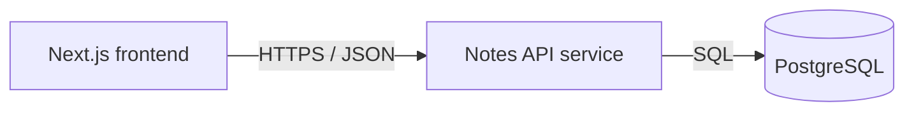

# Service & Interface Design — Sticky Notes

Last updated: 2026-05-27
Source: `docs/notes/SRS.md`, `docs/architecture/erd.md`, `docs/architecture/overview.md`

## 1. Service map



| Service | Responsibility | Owns (tables) | Depends on | Deploy unit |
|---|---|---|---|---|
| Notes API | List, create, and hard-delete notes | `notes` | PostgreSQL 16 | Go backend container |

**Why these boundaries** — single service: no boundary justified yet. Frontend and API deploy separately, but API owns all database access. `notes` has exactly one owner: Notes API.

## 2. Cross-cutting contract

### 2.1 Base

- Backend route base: `/v1`. Deployment proxy strips external `/api` prefix before backend routing; backend must not mount `/api`.
- Content type: `application/json; charset=utf-8` for JSON bodies.
- Versioning: URL-path major version. New major version only for breaking changes.
- `X-Request-Id`: caller may supply it; API generates one when absent, echoes it on every response, and logs it per request.
- IDs are decimal strings on wire. Timestamps are RFC 3339 UTC strings.

### 2.2 Authentication and authorization

| Aspect | Decision |
|---|---|
| Mechanism | None; all callers are guests in approved scope |
| Token lifetime / refresh | Not applicable |
| Roles | None |
| Enforcement point | Not applicable; no accounts or permissions exist |

### 2.3 Error contract

Every non-2xx response has this shape:

```json
{
  "error": {
    "code": "VALIDATION_FAILED",
    "message": "Request validation failed.",
    "details": [
      {"field": "text", "code": "TOO_LONG", "message": "Text must contain at most 280 characters."}
    ],
    "request_id": "01HX..."
  }
}
```

Consumers branch only on `error.code`. `message` and detail messages are safe display text and may change. `details` is omitted except for `VALIDATION_FAILED`; each entry has `field`, machine code, and message.

| Code | HTTP | Meaning | Retryable |
|---|---:|---|---|
| `MALFORMED_REQUEST` | 400 | Invalid JSON, wrong JSON type, or invalid path syntax | no |
| `VALIDATION_FAILED` | 422 | Well-formed request fails field validation | no |
| `INTERNAL` | 500 | Unexpected failure; internals logged only | yes |
| `UNAVAILABLE` | 503 | Database unavailable, timed out, or service draining | yes |

### 2.4 Pagination

No pagination query parameters exist. `GET /v1/notes` returns every saved note, required by NOTES-001 and bounded by current 100-note performance target. Collection response stays extensible: `{"data": [...], "total": 0}`. Adding pagination later is breaking because scope promises every note; ship a new version or explicit separate endpoint then.

Default order is stable `created_at DESC, id DESC`; database index enforces query access pattern.

### 2.5 Validation boundary

Go HTTP handler is validation boundary, before service or SQL call. It caps request body at 4 KiB, rejects malformed JSON and unknown fields, validates every path parameter, and validates `text` as string with 1–280 Unicode characters after trimming only to test emptiness. Original accepted text is stored unchanged. Database constraints remain final integrity backstop.

### 2.6 Idempotency

No endpoint accepts `Idempotency-Key`; schema scope permits only `id`, `text`, and `created_at`, so key replay cannot be durably detected. Clients must not automatically retry `POST /v1/notes` after an unknown result; instead refresh list before another user-initiated add. `DELETE` is idempotent: deleting missing ID returns `204`.

## 3. Endpoints

### 3.1 `GET /v1/notes`

**Purpose** — list every saved note newest first with current total. **Traces to** — NOTES-001. **Auth** — none.

**Path / query parameters** — none. Request body absent.

**Success response** — `200`

```json
{
  "data": [
    {"id": "42", "text": "Buy tea", "created_at": "2026-05-27T10:04:18Z"}
  ],
  "total": 1
}
```

| Field | Type | Nullable | Description |
|---|---|---|---|
| `data` | array of note | no | Every saved note, ordered newest first |
| `data[].id` | string | no | Decimal note ID |
| `data[].text` | string | no | Stored note body |
| `data[].created_at` | string | no | Creation timestamp in RFC 3339 UTC |
| `total` | integer | no | Current number of saved notes; equals `data` length |

**Errors**

| Code | HTTP | Trigger |
|---|---:|---|
| `UNAVAILABLE` | 503 | Database query cannot complete because dependency is unavailable or timed out |
| `INTERNAL` | 500 | Unexpected server failure |

**Notes** — empty list returns `{"data":[],"total":0}`. No side effects.

### 3.2 `POST /v1/notes`

**Purpose** — create one note. **Traces to** — NOTES-002. **Auth** — none.

**Request body**

```json
{"text": "Buy tea"}
```

| Field | Type | Required | Constraints | Description |
|---|---|---|---|---|
| `text` | string | yes | Non-empty after trim; maximum 280 Unicode characters | Note body |

**Success response** — `201`, with `Location: /v1/notes/{id}`

```json
{"id":"42","text":"Buy tea","created_at":"2026-05-27T10:04:18Z"}
```

| Field | Type | Nullable | Description |
|---|---|---|---|
| `id` | string | no | Generated decimal note ID |
| `text` | string | no | Stored request text |
| `created_at` | string | no | Database-generated RFC 3339 UTC timestamp |

**Errors**

| Code | HTTP | Trigger |
|---|---:|---|
| `MALFORMED_REQUEST` | 400 | Invalid JSON, non-object body, unknown field, or body exceeds 4 KiB |
| `VALIDATION_FAILED` | 422 | Missing, empty/whitespace-only, or over-280-character `text` |
| `UNAVAILABLE` | 503 | Database insert cannot complete because dependency is unavailable or timed out |
| `INTERNAL` | 500 | Unexpected server failure |

**Notes** — server creates `id` and `created_at`; client cannot send either. No automatic client retry after unknown outcome.

### 3.3 `DELETE /v1/notes/{id}`

**Purpose** — hard-delete one note. **Traces to** — NOTES-003. **Auth** — none.

**Path parameters**

| Name | In | Type | Required | Constraints | Description |
|---|---|---|---|---|---|
| `id` | path | string | yes | Base-10 integer greater than zero; no sign, decimal, or whitespace | Note ID |

Request body absent.

**Success response** — `204`, no body.

**Errors**

| Code | HTTP | Trigger |
|---|---:|---|
| `MALFORMED_REQUEST` | 400 | Path ID syntax is not valid decimal integer |
| `VALIDATION_FAILED` | 422 | Path ID is zero or negative |
| `UNAVAILABLE` | 503 | Database delete cannot complete because dependency is unavailable or timed out |
| `INTERNAL` | 500 | Unexpected server failure |

**Notes** — missing note also returns `204`; deletion is idempotent and satisfies already-removed card behavior. No cascade exists.

## 4. Asynchronous work

None. No queues, schedules, events, or cross-service calls exist.

## 5. External integrations

None. No third-party calls, credentials, setup steps, timeout, retry, or idempotency policy required.

## 6. Non-functional targets

| Aspect | Target |
|---|---|
| p95 latency (read) | 2 seconds end-to-end page-load target for 100 notes on 1 Mbps cold cache |
| p95 latency (write) | 1 second end-to-end add/delete UI target on 1 Mbps cold cache |
| Payload cap | 4 KiB request body; list response sized by current 100-note target |
| Timeout (inbound) | 5 seconds request deadline; database work uses remaining request context |

## 7. Observability

- Every request log: `request_id`, method, route, status, duration, and error code when present.
- Metrics per endpoint: request rate, error count by code, duration.
- Never log full request bodies, note text, database URLs, or credentials.

## 8. Contract evolution

| Change | Additive or breaking | Migration path |
|---|---|---|
| Add optional response field or new endpoint | Additive | Keep `/v1` existing behavior unchanged |
| Change/remove field, status, error mapping, ordering, validation, or list-all behavior | Breaking | Release `/v2`, migrate frontend, then deprecate `/v1` with date header |

## 9. Open questions

| Question | Owner | Blocking |
|---|---|---|
| Exact inline message for empty Add input | Stakeholder | No; frontend maps `VALIDATION_FAILED` to short inline message |

## 10. Story extension — Delete note

`DELETE /v1/notes/{id}` in section 3.3 is complete for NOTES-003. It removes only matching row with a parameterized primary-key delete. `204` for missing rows preserves idempotency and lets UI remove card when another action already removed it. Other rows and their `created_at DESC, id DESC` order stay unchanged.

### Reviewed UI mock alignment

Reviewed mock `code/frontend/lib/mock/delete-note.ts` renders `id` as number and `created_at` as local-looking `YYYY-MM-DD HH:mm` text. Existing cross-cutting API contract deliberately uses decimal-string IDs and RFC 3339 UTC timestamps. Backend must retain merged contract; frontend API wiring must parse/display these fields without changing delete target semantics. `DELETE` response has no body, so mock note shape does not affect response payload.

### Delete-specific errors

No error codes added. Section 3.3 reuses `MALFORMED_REQUEST` (400), `VALIDATION_FAILED` (422), `UNAVAILABLE` (503), and `INTERNAL` (500). `NOT_FOUND` is deliberately rejected: missing row returns `204` under existing idempotency contract.
