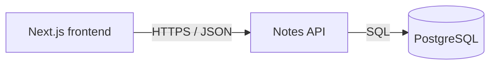

# Service & Interface Design — Sticky Notes

Last updated: 2026-05-27  
Source: `docs/notes/SRS.md`, `docs/architecture/erd.md`, `docs/architecture/overview.md`

## 1. Service map



| Service | Responsibility | Owns (tables) | Depends on | Deploy unit |
|---|---|---|---|---|
| Notes API | List, create, and hard-delete notes | `notes` | PostgreSQL 16 | `backend` container |

**Why these boundaries** — single service: no boundary justified yet. Frontend and API deploy separately, but only Notes API writes or reads `notes`.

## 2. Cross-cutting contract

### 2.1 Base

- Backend route base: `/v1`. Deploy proxy strips external `/api` prefix before backend routing; backend must not mount `/api`.
- Content type: `application/json; charset=utf-8` for bodies.
- Versioning: URL major version. New major version only for breaking changes.
- `X-Request-Id`: accept caller value or generate one; echo it on every response and include it in request logs.
- Timestamps: RFC 3339 UTC strings. JSON fields use `snake_case`; IDs are decimal strings.

### 2.2 Authentication and authorization

| Aspect | Decision |
|---|---|
| Mechanism | None. Guest access is approved scope. |
| Token lifetime / refresh | Not applicable. |
| Roles | None. |
| Enforcement point | No auth middleware; handlers allow all guests. |

### 2.3 Error contract

Every non-2xx response has this shape:

```json
{
  "error": {
    "code": "VALIDATION_FAILED",
    "message": "Text must be between 1 and 280 characters.",
    "details": [{"field": "text", "code": "OUT_OF_RANGE", "message": "Must contain 1 to 280 characters."}],
    "request_id": "request-id"
  }
}
```

Consumers branch on `error.code`; `message` and `details[].message` are safe display text, not stable. `details` is omitted unless validation identifies fields.

| Code | HTTP | Meaning | Retryable |
|---|---:|---|---|
| `MALFORMED_REQUEST` | 400 | Invalid JSON or unsupported JSON shape | no |
| `VALIDATION_FAILED` | 422 | Well-formed external value fails constraints | no |
| `INTERNAL` | 500 | Unexpected failure; internals logged only | yes |
| `UNAVAILABLE` | 503 | Database unavailable, migration incomplete, or service draining | yes |

### 2.4 Pagination

No pagination. `GET /v1/notes` returns every saved note because NOTES-001 requires every note and project target is 100 stored notes. No pagination parameters are accepted. Order is stable `created_at DESC, id DESC`.

### 2.5 Validation boundary

Notes API HTTP handlers validate path and JSON input before calling repository code: request body is capped at 1 KiB; `text` must be a JSON string with 1–280 Unicode characters after trimming whitespace. `created_at` and `id` are server-generated and rejected if supplied in create input. `id` path value must be a positive base-10 integer fitting PostgreSQL `bigint`. Repository code trusts validated values; database constraints remain final integrity protection.

### 2.6 Idempotency

No endpoint accepts `Idempotency-Key`. Frontend must not automatically retry `POST /v1/notes`, since retry could create another note. `DELETE /v1/notes/{id}` is idempotent: missing row still returns `204`.

## 3. Endpoints

### 3.1 `GET /v1/notes`

**Purpose** — list all saved notes, newest first. **Traces to** — NOTES-001. **Auth** — guest.

No path, query, or request-body fields are accepted.

**Success response** — `200`

```json
{
  "data": [
    {"id": "42", "text": "Buy milk", "created_at": "2026-05-27T10:04:18Z"}
  ]
}
```

| Field | Type | Nullable | Description |
|---|---|---|---|
| `data` | array of note | no | All notes in `created_at DESC, id DESC` order; empty when none exist. |
| `data[].id` | string | no | Decimal generated note ID. |
| `data[].text` | string | no | Stored note body. |
| `data[].created_at` | string | no | UTC creation time. |

**Errors**

| Code | HTTP | Trigger |
|---|---:|---|
| `INTERNAL` | 500 | Unexpected processing failure. |
| `UNAVAILABLE` | 503 | Database cannot serve read. |

### 3.2 `POST /v1/notes`

**Purpose** — create one note. **Traces to** — NOTES-002. **Auth** — guest.

**Request body**

```json
{"text": "Buy milk"}
```

| Field | Type | Required | Constraints | Description |
|---|---|---|---|---|
| `text` | string | yes | Trimmed value: 1–280 Unicode characters | Note body. |

Unknown fields are rejected as `MALFORMED_REQUEST`.

**Success response** — `201`; `Location: /v1/notes/{id}`

```json
{"id": "42", "text": "Buy milk", "created_at": "2026-05-27T10:04:18Z"}
```

Response fields have same types and meanings as list note fields. `created_at` is database-generated UTC time.

**Errors**

| Code | HTTP | Trigger |
|---|---:|---|
| `MALFORMED_REQUEST` | 400 | Invalid JSON, non-object body, unknown field, or wrong JSON type. |
| `VALIDATION_FAILED` | 422 | Missing, empty, whitespace-only, or over-280-character `text`. |
| `INTERNAL` | 500 | Unexpected processing failure. |
| `UNAVAILABLE` | 503 | Database cannot save note. |

**Notes** — no retry or idempotency key. Successful creation commits exactly one row.

### 3.3 `DELETE /v1/notes/{id}`

**Purpose** — hard-delete one note. **Traces to** — NOTES-003. **Auth** — guest.

| Name | In | Type | Required | Constraints | Description |
|---|---|---|---|---|---|
| `id` | path | string | yes | Positive base-10 `bigint` | Note ID. |

No request body is accepted.

**Success response** — `204`, no body. A missing row also returns `204`; client removes target card, satisfying already-removed behavior without duplicate delete state.

**Errors**

| Code | HTTP | Trigger |
|---|---:|---|
| `VALIDATION_FAILED` | 422 | `id` is absent, non-numeric, zero, negative, or out of range. |
| `INTERNAL` | 500 | Unexpected processing failure. |
| `UNAVAILABLE` | 503 | Database cannot delete note. |

**Notes** — idempotent. Hard delete changes no other rows and preserves remaining list ordering.

## 4. Asynchronous work

None. Requests synchronously query PostgreSQL. No queues, jobs, schedules, or events.

## 5. External integrations

None. PostgreSQL is owned project infrastructure, not a third-party integration. No cross-service calls, credentials beyond `DATABASE_URL`, callback registration, timeouts, retries, or idempotency keys apply.

## 6. Non-functional targets

| Aspect | Target |
|---|---|
| p95 latency (read) | ≤1 s end-to-end on stated 1 Mbps cold-cache target with 100 notes |
| p95 latency (write) | ≤1 s end-to-end on stated target |
| Availability | Development project; no availability SLA |
| Rate limit | None in approved scope |
| Payload cap | 1 KiB for create body |
| Timeout (inbound) | 5 s request deadline; return `UNAVAILABLE` if database work cannot complete |

## 7. Observability

- Every request log: `request_id`, method, path, status, duration_ms; database failures also log internal error context.
- Metrics per endpoint: request count, error count, duration.
- Never log note text, request body, credentials, or database URL.

## 8. Contract evolution

| Change | Additive or breaking | Migration path |
|---|---|---|
| Initial `/v1/notes` endpoints | Additive | First consumer contract. |
| Future optional response field or endpoint | Additive | Ship under `/v1`; frontend ignores unknown fields. |
| Remove/rename field, alter ordering, change validation/status | Breaking | Add `/v2` only after frontend migrates; retain `/v1` through announced deprecation. |

## 9. Open questions

| Question | Owner | Blocking |
|---|---|---|
| Exact inline empty-text message | Stakeholder | No; API returns `VALIDATION_FAILED`. |
